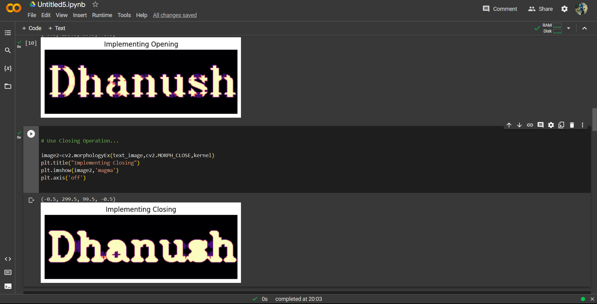

# Opening-and-Closing

## Aim
To implement Opening and Closing using Python and OpenCV.

## Software Required
1. Anaconda - Python 3.7
2. OpenCV
## Algorithm:
### Step1:
Load the necessary packages requiured for the implemtation of opening and closing.


### Step2:
Create the text image for the implemtation of opening and closing using cv2.putText function.


### Step3:
Create the structuring image for the implemtation of opening and closing on the text image.


### Step4:
Apply the erosion and dilation to the text image using cv2.MORPH_OPEN and cv2.MORPH_CLOSE.


### Step5:
Display the images of the erosion and dilation applied using the plt.imshow.


 
## Program:

``` Python
# Import the necessary packages

import cv2
import numpy as np
import matplotlib.pyplot as plt


# Create the Text using cv2.putText

text_image = np.zeros((100,300),dtype = 'uint8')
font = cv2.FONT_HERSHEY_SCRIPT_COMPLEX = 3
cv2.putText(text_image,"Richard",(5,70),font,2,(255),5,cv2.LINE_AA)
plt.title("Original Text Image")
plt.imshow(text_image,'magma')
plt.axis('off')


# Create the structuring element...

kernel = cv2.getStructuringElement(cv2.MORPH_CROSS,(9,9))


# Use Opening operation...

image1=cv2.morphologyEx(text_image,cv2.MORPH_OPEN,kernel)
plt.title("Implementing Opening")
plt.imshow(image1,'magma')
plt.axis('off')


# Use Closing Operation...

image2=cv2.morphologyEx(text_image,cv2.MORPH_CLOSE,kernel)
plt.title("Implementing Closing")
plt.imshow(image2,'magma')
plt.axis('off')


```
## Output:




## Result
Thus the Opening and Closing operation is used in the image using python and OpenCV.
